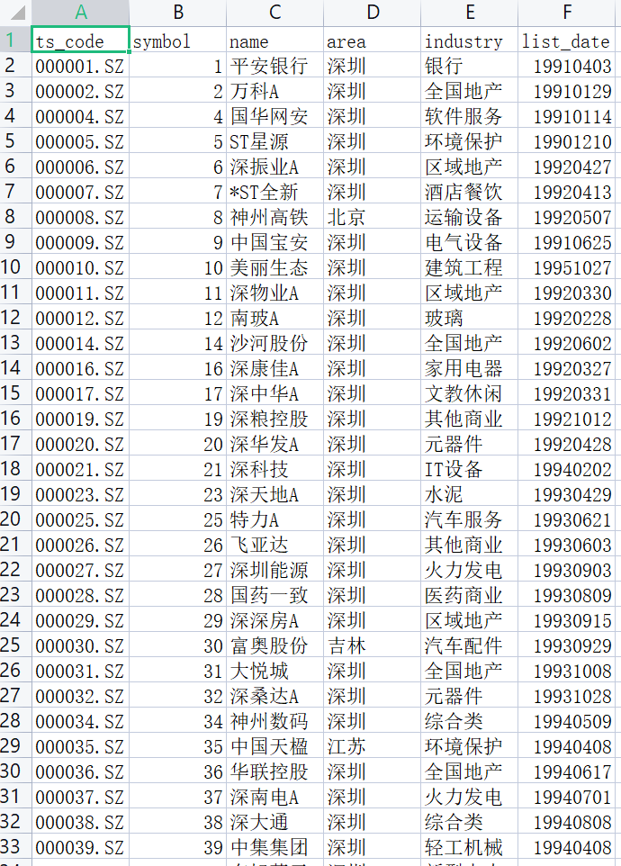

# 获取新浪股票数据转换成DF

#### 介绍
geSinaStockData

#### 软件架构
软件架构说明


#### 安装教程

1. 设置股票列表文件

2. 新浪获取股票信息格式

https://hq.sinajs.cn/list=sz002085
```angular2html
var hq_str_sz002085="万丰奥威,5.520,5.540,5.540,5.570,5.510,5.540,5.550,10225636,56559527.340,56400,5.540,46040,5.530,147500,5.520,337250,5.510,531500,5.500,298800,5.550,219400,5.560,282100,5.570,204700,5.580,207200,5.590,2022-01-19,15:00:03,00";
```
3. 使用python pandas

#### 使用说明

1. 使用相关库文件
```angular2html
import re,sys,urllib.request,time
import pandas as pd
```

2. 相关函数

**GetSinaALLData**
>获取新浪数据，有字典生成df
**GetSinaData**

**get_data**
>生成分段请求数据，返回df
**getlist**
>获取股票列表数据


3. 程序运行

````angular2html
if __name__ == '__main__':
    printinfo("program is running....")

    sn = SinaData()
    sn.get_data()
````

4. 工具函数
````angular2html

#-*-coding:gb2312-*-
from colorama import init, Fore, Back, Style
init(autoreset=True)
def printinfo(text,colr="GREEN"):
    if colr=="CYAN":
        print(Fore.CYAN +Style.BRIGHT+ text)
    if colr=="RED":
        print(Fore.RED +Style.BRIGHT+ text)
    if colr=="BLUE":
        print(Fore.BLUE +Style.BRIGHT+ text)
    if colr=="GREEN":
        print(Fore.GREEN +Style.BRIGHT+ text)
    if colr=="WHITE":
        print(Fore.WHITE +Style.BRIGHT+ text)
    if colr=="YELLOW":
        print(Fore.YELLOW +Style.BRIGHT+ text)
    if colr=="MAGENTA":
        print(Fore.MAGENTA +Style.BRIGHT+ text)
    if colr=="LIGHTYELLOW_EX":
        print(Fore.LIGHTYELLOW_EX +Style.BRIGHT+ text)
    if colr=="REDB":
        print(Fore.RESET +Style.BRIGHT+Back.RED+ text)
    if colr=="MAGENTAB":
        print(Fore.RESET +Style.BRIGHT+Back.MAGENTA+ text)
    if colr=="BLUEB":
        print(Fore.WHITE +Style.BRIGHT+Back.BLUE+ text)
    if colr=="GREENB":
        print(Fore.YELLOW +Style.BRIGHT+Back.GREEN+ text)

def set_title():
    fo = open("banner.txt", "r")
    # print("文件名为: ", fo.name)
    strtmp = ""
    for line in fo.readlines():  # 依次读取每行
        # line = line.strip()  # 去掉每行头尾空白
        # print("读取的数据为: %s" % (line))
        strtmp += line

    # 关闭文件
    fo.close()
    return strtmp
````
#### 参与贡献

1. Fork 本仓库
2. 新建 Feat_xxx 分支
3. 提交代码
4. 新建 Pull Request
5. 开发喵版权所有
http://www.kaifamiao.co

#### 特技

1.  使用 Readme\_XXX.md 来支持不同的语言，例如 Readme\_en.md, Readme\_zh.md
2.  Gitee 官方博客 [blog.gitee.com](https://blog.gitee.com)
3.  你可以 [https://gitee.com/explore](https://gitee.com/explore) 这个地址来了解 Gitee 上的优秀开源项目
4.  [GVP](https://gitee.com/gvp) 全称是 Gitee 最有价值开源项目，是综合评定出的优秀开源项目
5.  Gitee 官方提供的使用手册 [https://gitee.com/help](https://gitee.com/help)
6.  Gitee 封面人物是一档用来展示 Gitee 会员风采的栏目 [https://gitee.com/gitee-stars/](https://gitee.com/gitee-stars/)
